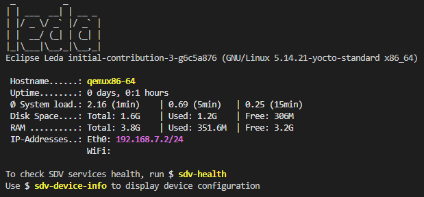

# Leda Core Utilities

Some optional utilities and scripts for the runtime:
- *sdv-device-info*: Show and update device information
- *sdv-health*: Show SDV software components health status
- *sdv-motd*: Message-of-the-Day shown after login prompt
- *can-forward*: Forwarding a CAN-bus network interface into a containerized Vehicle Application

# Usage

## SDV Device Info

Synposis: `./sdv-device-info [options] [command]`

Full help:
```
Usage: ./sdv-device-info [options] [command]
Update SDV device configuration information in configuration files.
Example: ./sdv-device-info -v env"

Commands:
 show                 : Display configuration (default command)
 help                 : This message
 version              : Display the SDV software stack versions
 env                  : Format output for use in scripts

Options:
 --ansi | -a      : Don't use colored output.
 --norestart | -n : Do not automatically restart services
 --verbose | -v   : Enable verbose mode.
 --help | -h      : This message.

```

### Display current device information

Display the current device configuration, such as Device ID.

Synposis: `./sdv-device-info show`

### Use device information in scripts

To use device information on other scripts, it may be useful to source the device information variables into the current environment variable context:

Synposis: `source ./sdv-device-info env`

Example:
```
$ source ./sdv-device-info env
$ echo $DEVICE_ID
exampledevice1
```

## SDV Health

The `./sdv-health` utility display a status overview of some important dependencies and device configurations for the SDV stack.
The sdv health utility can be configured using the `sdv.conf` configuration file.

Example output:


## can-forward

Synposis:
```
Usage:  ./can-forward {-h} {-p PID} {-c container} <hw_can>

  hw_can          Host CAN hw interface to forward. Default: can0
  -c container    Attemmpt to get netns PID from a running container: (docker, ctr). Default: seat_service
  -p PID          Use provided PID for transferring vxcan interface (e.g.: docker inspect -f '{{ .State.Pid }}' container)
  -h              Prints this message
```

Example:
```
$ ps -C seat_service -o pid=
$ ./can-forward -p 1234 can0
```

> **Note:** can-forward does currently not support looking up PID of Kubernetes pods.

## SDV Message of the Day

The `sdv-motd` script provides an alternative motd profile, which displays some additional information after login.

Example output:


# Requirements and installation

The utility scripts currently require `bash`.
The utilities are pre-installed on Eclipse Leda Quickstart distros in the *SDV Full Image* partition.

## Manual installation

- Install bash
- Copy the scripts to the device, e.g. to `/usr/bin/` or to your user's home directory
- Ensure executable bit: `chmod a+x sdv-*`

# Contributing

## Visual Studio DevContainer Setup

- Clone the repository into Visual Studio (`F1` -> `Remote-Containers: Clone repository into volume`)
- Provide the git repository url.

# License and Copyright

Please see (LICENSE)[LICENSE]


